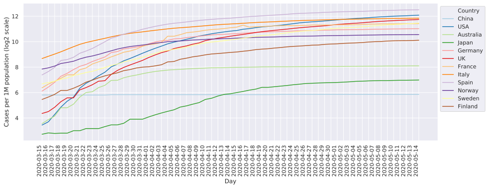
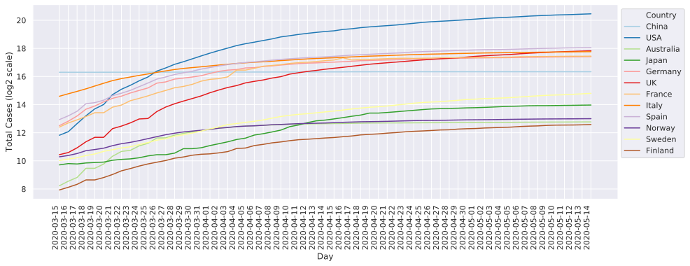
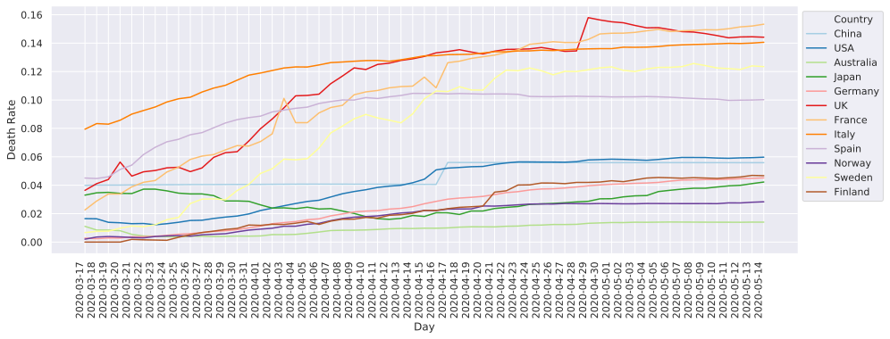
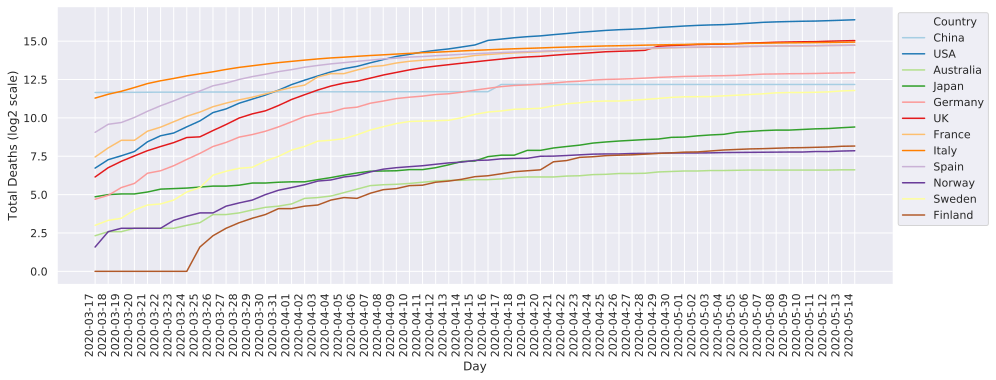

# CovidBot
Non-retrospectively monitoring of COVID-19 pandemic over time

## COVID-19 Pandemic Monitoring

Data collection of relevant statistics about the novel Coronavirus pandemic was started on 2020-03-15, with the exception of deaths count which was started on 2020-03-17. Plots generated by CovidBot are reported below and updated every day at 23:30, Helsinki time (GMT+2). Note that only the data for a subset of countries is displayed. The row data contains information for 22 countries.

### Confirmed Coronavirus Cases Per 1 Million Citizens



### Confirmed Total Coronavirus Cases



### Coronavirus Death Rate



### Total Confirmed Deaths Due To Coronavirus



## Data Collection

CovidBot fetches the current data published at https://www.worldometers.info/coronavirus/ and adds those data to existing local files. If those files are not present, it starts the data collection from scratch. This task is not meant to be performed more than once per day. After every run, CovidBot uses all the available data to generate updated plots.

Data collected and processed over time are stored in the following tsv files:

* `covid_cases_1M_pop.tsv`: number of cases per 1 million citizens
* `covid_death_rate.tsv`: number of deaths / number of cases
* `covid_total_cases.tsv`: total number of cases
* `covid_total_deaths.tsv`: total number of deaths

Accordingly, the following plots are generated:

* `covid_cases_1M_pop.svg`
* `covid_death_rate.svg`
* `covid_total_cases.svg`
* `covid_total_deaths.svg`

## How To Use CovidBot

CovidBot can be run every day to automatically collect data over time, store them locally, and generate plots. To do so the easiest and fully-automatic way is to use `crontab` to run it daily at a specified time, e.g. 23:55. Here is how to do it:

Clone this repository in a `/path/of/your/choice`:

```
cd /path/of/your/choice
git clone https://github.com/alussana/covidbot
```

Add the task to the `crontab` schedule:

* `crontab -e` will open the crontab task file

* Add the following line and save it:

  `55 23 * * * cd /path/of/your/choice/covidbot; ./covidbot.py >/dev/null 2>&1`

### Requirements

* [Firefox browser](https://www.mozilla.org)
* [geckodriver](https://github.com/mozilla/geckodriver/releases)
* [Python3](https://www.python.org), plus following libraries:
  * [Pandas](https://pandas.pydata.org)
  * [Seaborn](https://seaborn.pydata.org)
  * [Selenium](https://selenium-python.readthedocs.io)

## Background

Around the 15th of March 2020 COVID-19 cases started to increase in Finland, the country that is hosting me while I'm working on my Master's thesis project. I then developed a simple tool to track the changes of a few metrics related to the COVID-19 pandemic over time and in different regions of the world. I decided to collect publicly available data for my personal interest, in order to monitor the situation and display the information that are more relevant to me in a customized manner.

## Upcoming Features

[X] Plot of death rate by country

[_] Plot of non-cumulative distribution of new cases by country

[_] Mail alert

Have comments, suggestions, or interest in collaboration? Just drop a quick email to alessandro.lussana@pm.me